# ✨ Aura - Full Stack Fashion E-Commerce Platform

Aura is a modern full-stack fashion e-commerce platform designed to deliver a seamless online shopping experience for customers while providing administrators with a powerful dashboard to manage products, categories, users, and orders.

The project is built using the **MERN Stack** with **React + TypeScript**, **Node.js**, **Express.js**, and **MongoDB**. It includes secure JWT authentication, OTP-based email verification, product image uploads, shopping cart, wishlist, and complete order management.

---

## 🎥 Project Demo

### 👤 User Demo

📁 Google Drive: https://drive.google.com/drive/folders/1urn7SEfkrPoCP7S2pSkLL7Bc1bGrwYhQ?usp=sharing

### 👨‍💼 Admin Dashboard Demo

📁 Google Drive: https://drive.google.com/drive/folders/1urn7SEfkrPoCP7S2pSkLL7Bc1bGrwYhQ?usp=sharing

---

## 📸 Screenshots

### Homepage


### Login

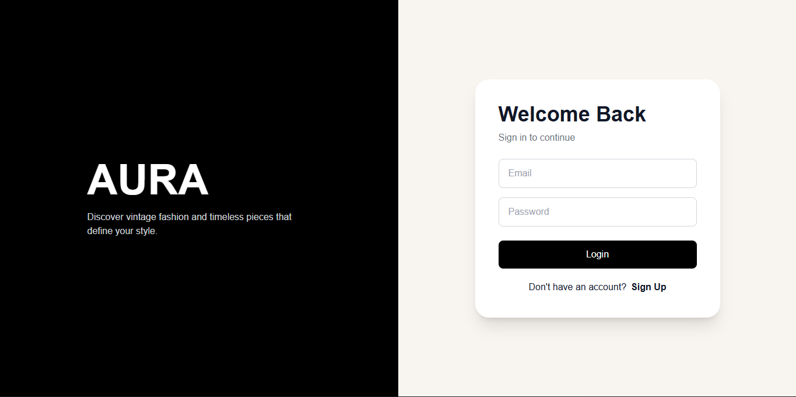

### Signup

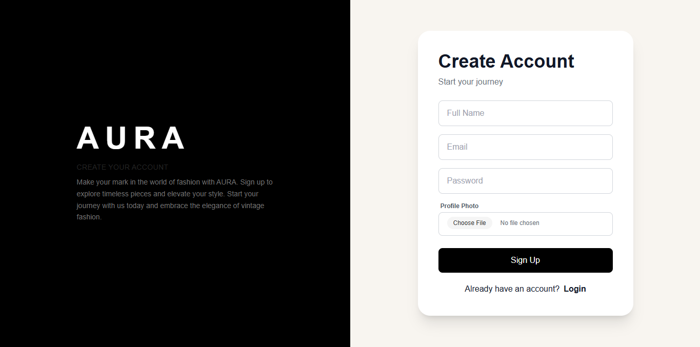

### Otp Verification

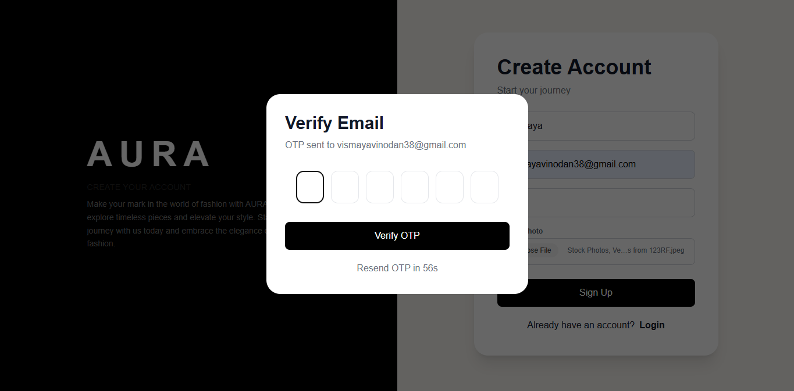

### Product Details


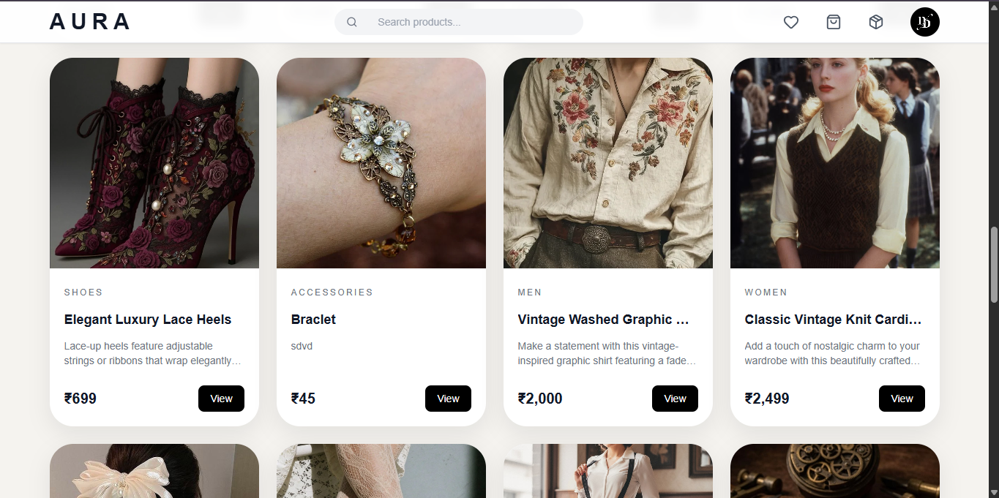


### Search

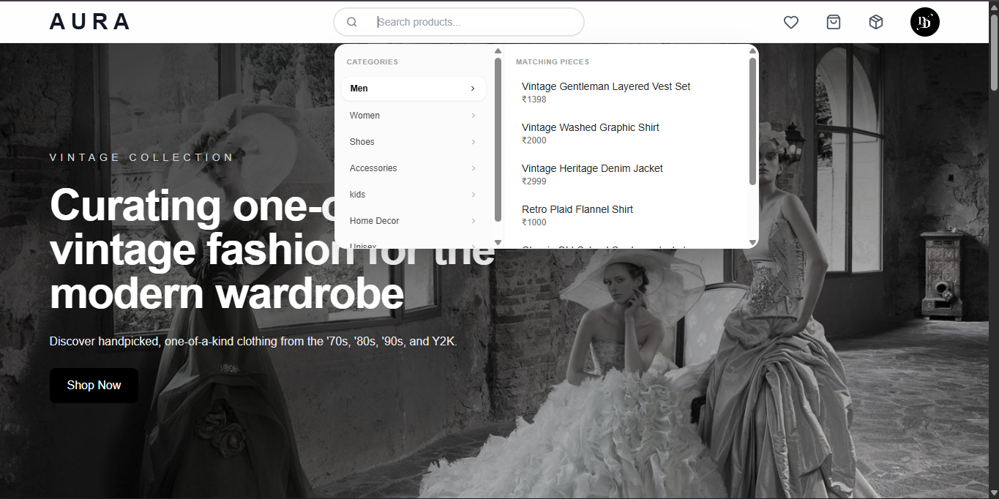

### Shopping Cart

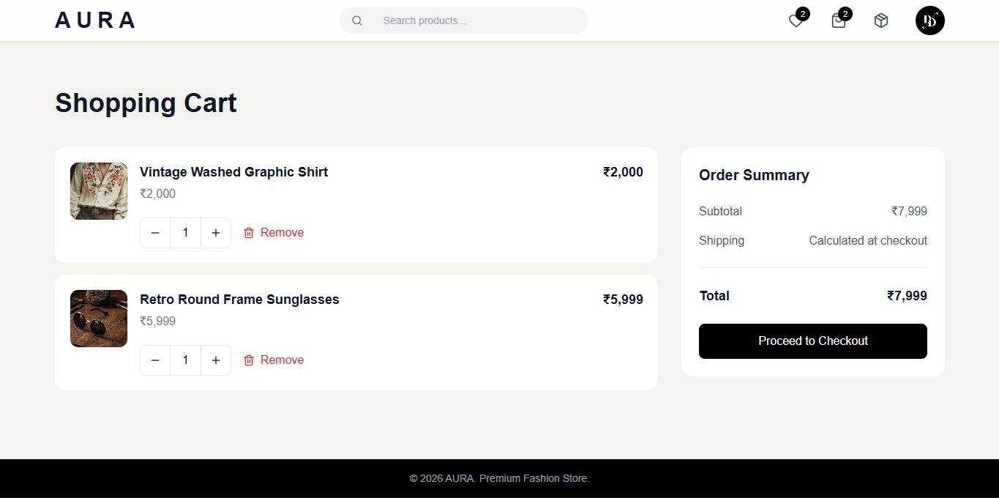

### Wishlist

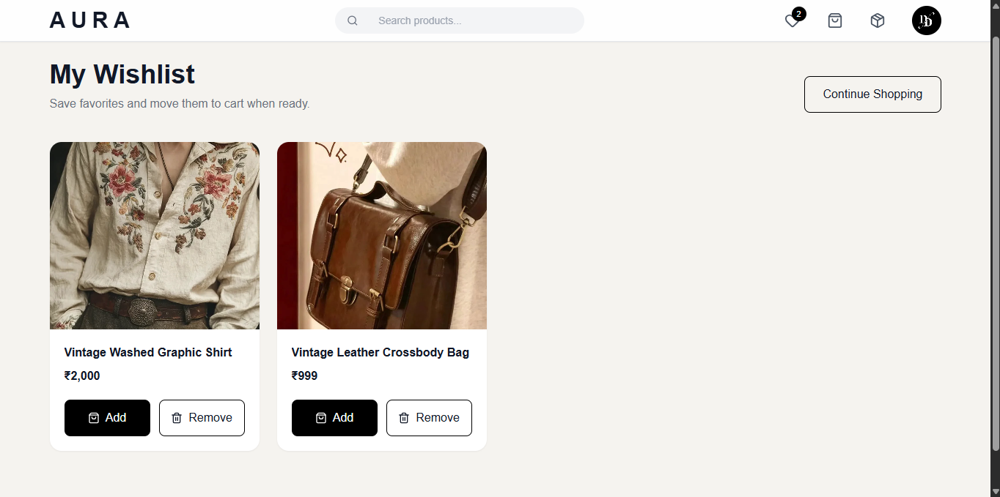

### Checkout

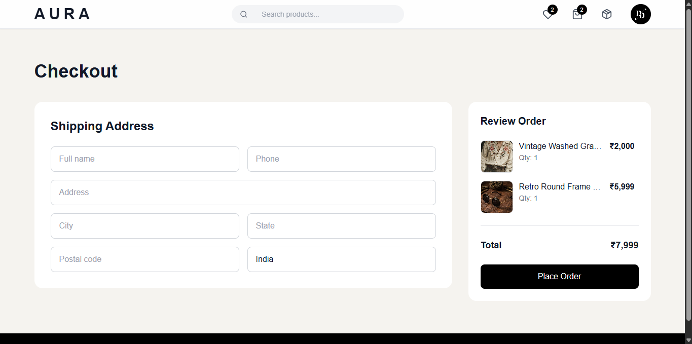

### Orders

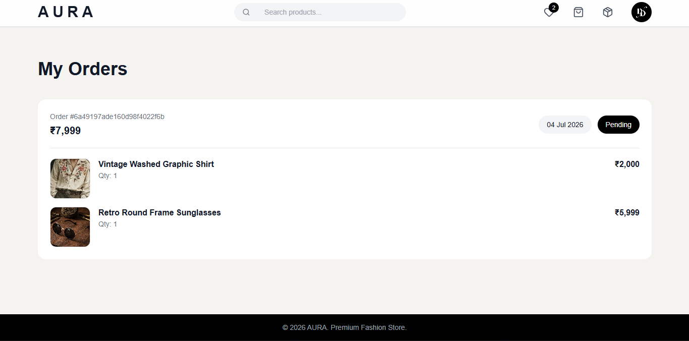

### User Profile

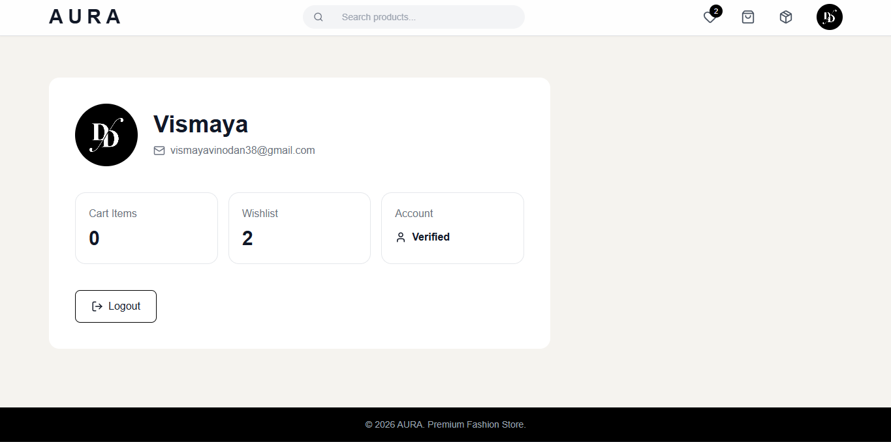

### Admin Dashboard

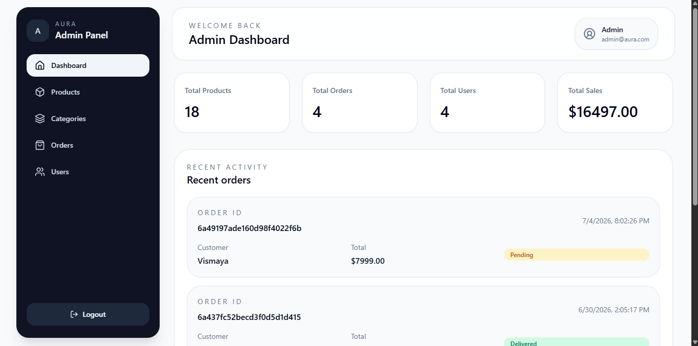

### Admin Login

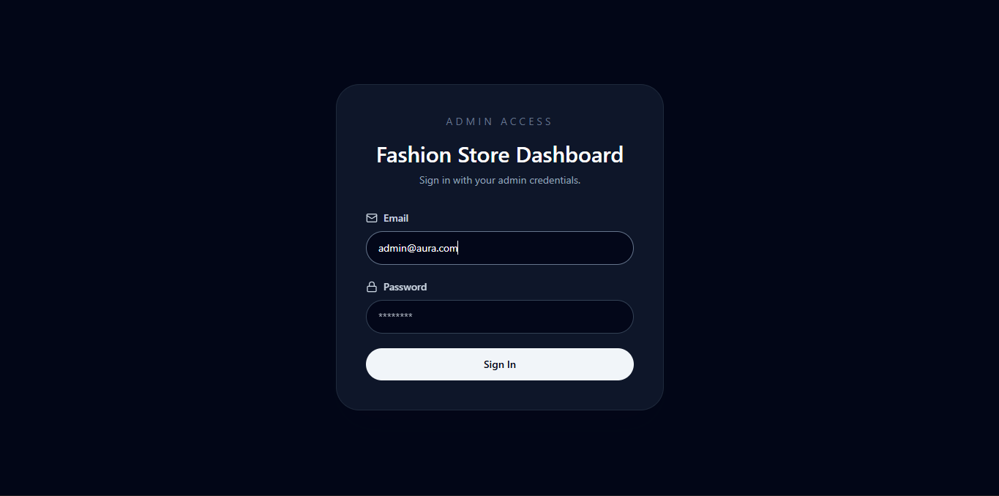

### Product Management

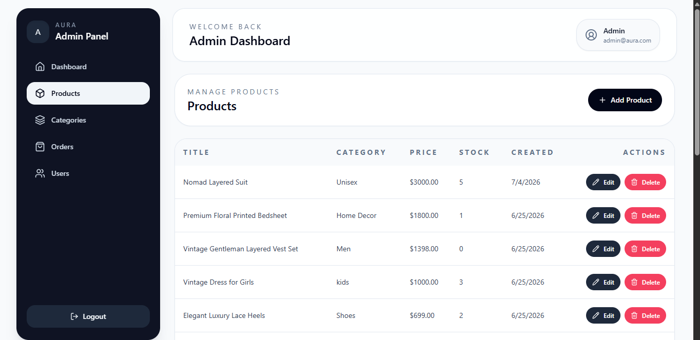

### Category Management

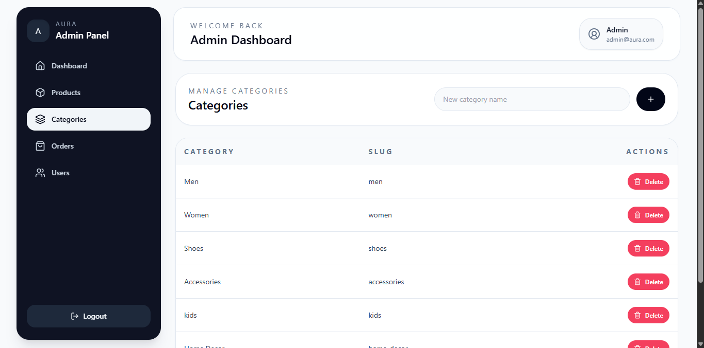

### Order Management

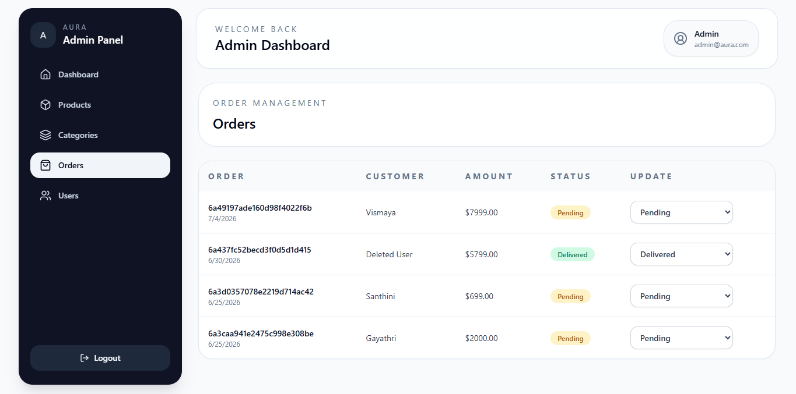

### User Management

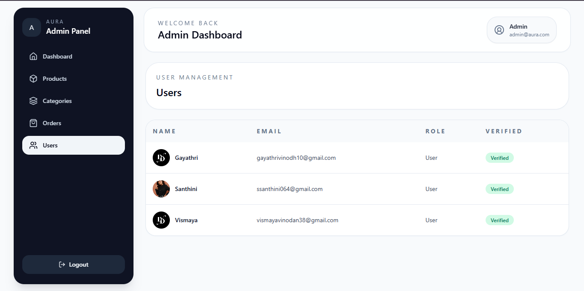

---

# 🚀 Features

## 👤 Customer Features

* Secure User Registration
* JWT Authentication
* OTP Email Verification
* User Login & Logout
* Browse Products
* Dynamic Categories
* Product Search
* Product Details
* Shopping Cart
* Wishlist
* Checkout
* Order History
* User Profile
* Responsive Desktop Interface

---

## 👨‍💼 Admin Features

* Secure Admin Login
* Dashboard Overview
* Product Management

  * Create Products
  * Edit Products
  * Delete Products
  * Upload Product Images
* Category Management
* User Management
* Order Management
* Update Order Status
* Inventory Management

---

# 🛠 Tech Stack

## Frontend

* React.js
* TypeScript
* Vite
* Tailwind CSS
* React Router DOM
* Axios
* Lucide React

## Backend

* Node.js
* Express.js
* MongoDB
* Mongoose
* JWT Authentication
* Bcrypt.js
* Nodemailer
* Multer

---

# 🔐 Authentication & Security

* JWT Authentication
* Protected Routes
* Role-Based Authorization
* OTP Email Verification
* Password Hashing using Bcrypt
* Secure API Access

---

# 📂 Project Structure

```text
Aura
│
├── backend
│   ├── config
│   ├── controllers
│   ├── middleware
│   ├── models
│   ├── routes
│   ├── uploads
│   ├── utils
│   ├── server.js
│   └── package.json
│
├── frontend-user
│   ├── public
│   ├── src
│   │   ├── api
│   │   ├── components
│   │   ├── context
│   │   ├── hooks
│   │   ├── pages
│   │   ├── services
│   │   ├── types
│   │   └── utils
│   └── package.json
│
├── frontend-admin
│   ├── public
│   ├── src
│   │   ├── api
│   │   ├── components
│   │   ├── pages
│   │   ├── services
│   │   └── types
│   └── package.json
│
├── screenshots
└── README.md
```

---

# ⚙️ Installation

## 1. Clone the Repository

```bash
git clone https://github.com/vismayaviz/Aura.git
```

```bash
cd Aura
```

---

## 2. Install Backend Dependencies

```bash
cd backend
npm install
```

---

## 3. Configure Environment Variables

Create a `.env` file inside the `backend` folder.

```env
PORT=5000

MONGO_URI=your_mongodb_connection_string

JWT_SECRET=your_secret_key

EMAIL_USER=your_email@gmail.com

EMAIL_PASS=your_app_password
```

---

## 4. Start Backend

```bash
npm run dev
```

---

## 5. Start User Frontend

```bash
cd ../frontend-user
npm install
npm run dev
```

---

## 6. Start Admin Frontend

```bash
cd ../frontend-admin
npm install
npm run dev
```

---

# 🗄 Database Collections

* Users
* Categories
* Products
* Cart
* Wishlist
* Orders

---

# 📦 Core Functionalities

### Authentication

* User Registration
* Login
* OTP Verification
* JWT Authentication

### Products

* Create Products
* Edit Products
* Delete Products
* Image Upload using Multer
* Product Search

### Categories

* Create Categories
* Delete Categories
* Dynamic Category Listing

### Shopping

* Add to Cart
* Update Cart Quantity
* Remove from Cart
* Wishlist Management
* Checkout
* Order History

### Admin

* Manage Products
* Manage Categories
* Manage Orders
* Manage Users
* Update Order Status

---

# 🌱 Future Enhancements

* Fully Responsive Mobile UI
* Online Payment Integration (Stripe / Razorpay)
* Product Reviews & Ratings
* Coupons & Discounts
* Order Tracking
* Analytics Dashboard
* Sales Reports
* Product Recommendations

---

# 💡 Key Learning Outcomes

* Building a scalable MERN architecture
* Authentication & Authorization with JWT
* OTP-based email verification
* RESTful API development
* MongoDB schema design
* File uploads with Multer
* State management using React Context API
* Type-safe development with TypeScript
* Modern UI development with Tailwind CSS

---

# 👨‍💻 Developed By

**Vismaya Vinodan**

* 💼 LinkedIn: https://www.linkedin.com/in/vismaya38
* 💻 GitHub: https://github.com/vismayaviz

---

# 📜 License

This project is developed for educational purposes.

---

## ⭐ Support

If you found this project helpful or interesting, consider giving the repository a **⭐ Star** on GitHub.
